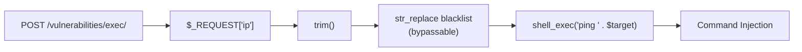

# Security Scanning
<!-- # Quick Start -->

CoStrict Security is a self-developed AI-powered security scanning tool that provides comprehensive coverage of common security vulnerabilities including injection attacks, unauthorized access, sensitive information disclosure, and insecure configurations. It delivers complete risk tracing and actionable remediation suggestions, helping you effectively eliminate security risks before deploying code.

## System Requirements

| Installation Method | Version Requirement | Supported Platforms |
|---|---|---|
| CLI Command Line Tool | ≥ 3.0.15 | CLI Terminal |

## Usage

Perform interactive security reviews via CLI during the development phase, providing real-time assistance to help developers identify and fix security issues.

- Supports a conversational interactive window for seamless communication and quick issue pinpointing
- Can incorporate prior knowledge such as business context and threat models for more precise detection results
- Displays the model's reasoning process so you understand why each issue was flagged

### Step 1: Enter Interactive Window

Enter the following command in the terminal to start CoStrict:

```bash
cs
```

<!-- TODO: Add screenshot - 进入交互窗口 -->
<!--  -->

### Step 2: Select Review Target

After entering the security review, the system will ask you what you want to review. Three review scopes are supported:

| Scope | Description |
|------|------|
| Specific file | Review a single specified file, suitable for targeted security checks on individual files |
| Specific directory | Review all code files in a specified directory and its subdirectories, suitable for reviewing specific modules or components |
| Specific branch | Review code changes in a specified Git branch, suitable for reviewing branch code before merging |

<!-- TODO: Add screenshot - 指定审查范围 -->
<!--  -->

### Step 3: View Review Report

After triggering the security review, the CLI interactive window displays the review process in real time. If any dangerous operations are detected during the review, manual confirmation is required before proceeding. Review duration varies with code volume, ranging from a few minutes to several tens of minutes. Once complete, a security review report is generated locally in the project. The report includes three types of files:

| Report File | Type | Description |
|---|---|---|
| `task_summary.md` | Summary report | A developer-readable summary containing review overview and issue aggregation |
| `[target-file]-report-[vuln-index].json` | Single-file vulnerability report | Detailed vulnerability information for a single file, suitable for integrating into custom review workflows |
| `full_report.jsonl` | Merged report | A consolidated file of all review results (JSONL format), suitable for CI/CD pipeline integration |

<details>
<summary>Security Audit Task Summary Example</summary>

### Audit Overview

| Item | Content |
|------|------|
| Audit Date | 2025-01-16 |
| Reviewed Directory | e:/Projects/DVWA |
| Files Audited | 1 |
| Vulnerabilities Found | 2 |
| Output Directory | security-review_result/ |

### Audited Files

| File Path | Vulnerabilities | Risk Level |
|----------|--------|----------|
| vulnerabilities/exec/source/high.php | 2 | High |

### Vulnerability Statistics

| Vulnerability Type | Count | Severity |
|----------|------|----------|
| Command Injection (COMMAND_INJECTION) | 2 | High |

---

### <span style={{color: '#E53935'}}>[High]</span> Vulnerability Detail: Command Injection - Incomplete Blacklist Filter Allows Pipe Bypass

- **File Location**: `vulnerabilities/exec/source/high.php:24-31`
- **Severity**: High
- **Vulnerability Type**: Command Injection

**Description**

The code uses a blacklist approach to filter Shell special characters in user input, but the blacklist is incomplete. The pipe character filter `'| '` (pipe + space) only filters this exact combination, allowing attackers to bypass it using a pipe without a space `|`.

**Data Flow**



**Bypass Method**

- Payload: `127.0.0.1|whoami` (pipe followed directly by command, no space needed)
- After filtering: `ping 127.0.0.1|whoami` successfully injected

**Business Impact**

- Remote Code Execution (RCE)
- Sensitive Data Leakage
- Privilege Escalation
- Internal Network Penetration

**Remediation**

Use whitelist validation instead of blacklist filtering, only allowing legitimate IP address formats:

```php
// Use whitelist validation, only allowing legitimate IP address formats
$octet = explode(".", $target);

if ((is_numeric($octet[0])) && (is_numeric($octet[1])) &&
    (is_numeric($octet[2])) && (is_numeric($octet[3])) &&
    (sizeof($octet) == 4) &&
    ($octet[0] >= 0 && $octet[0] <= 255) &&
    ($octet[1] >= 0 && $octet[1] <= 255) &&
    ($octet[2] >= 0 && $octet[2] <= 255) &&
    ($octet[3] >= 0 && $octet[3] <= 255)) {
    // Legitimate IP address, safe to execute
    $cmd = shell_exec('ping -c 4 ' . $target);
}
```

</details>

<!-- TODO: Add screenshot - 安全扫描报告 -->
<!--  -->
