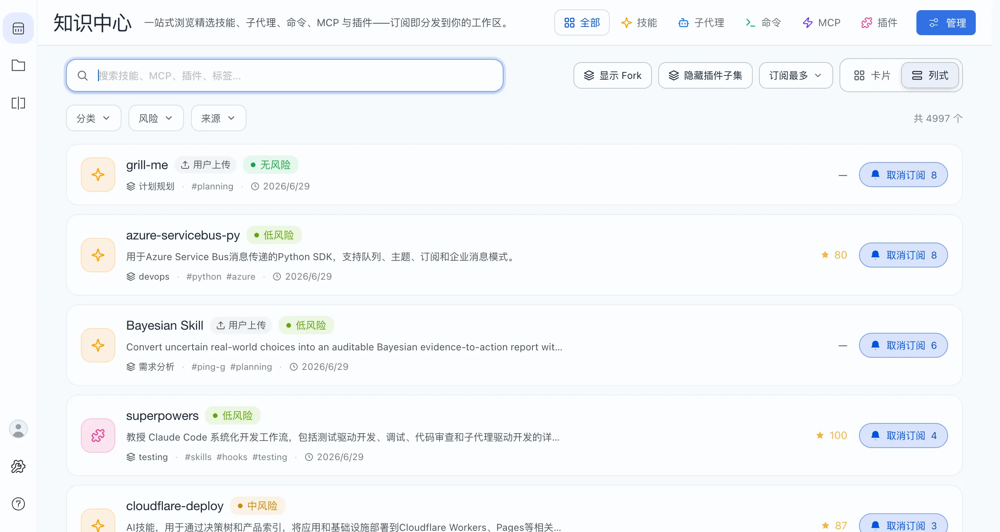
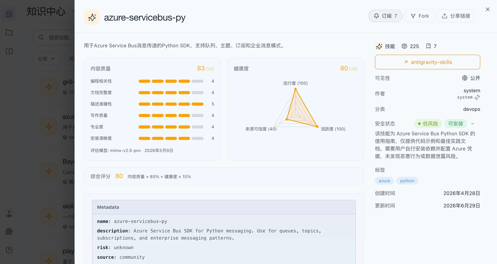
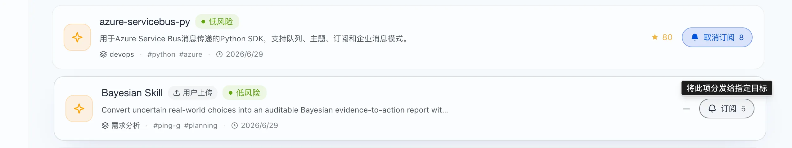
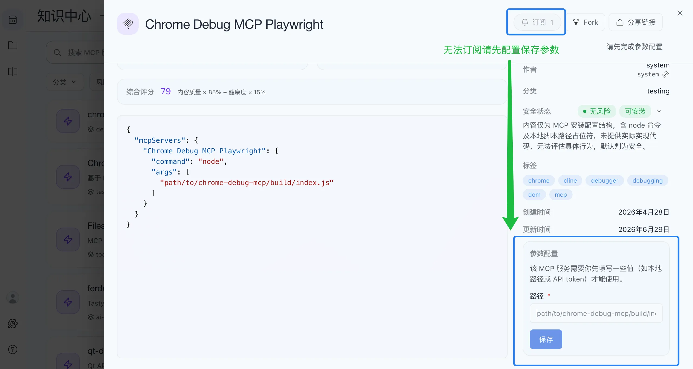
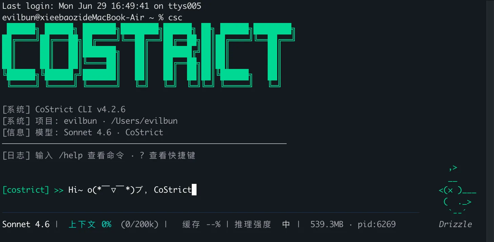
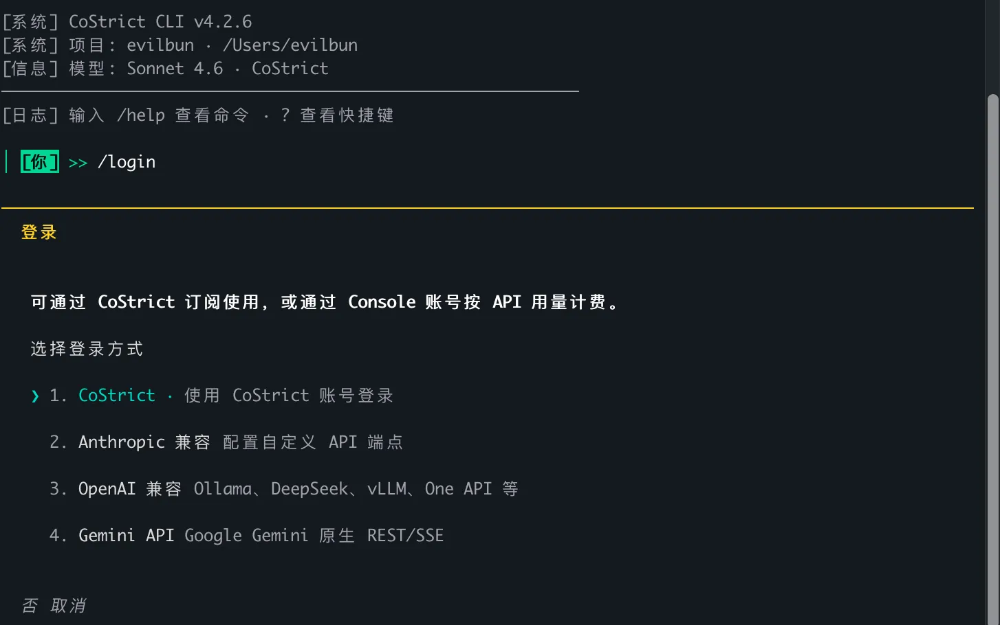
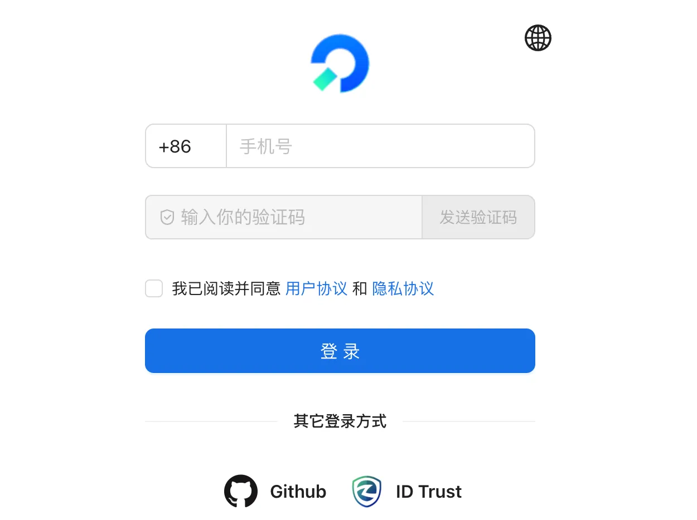
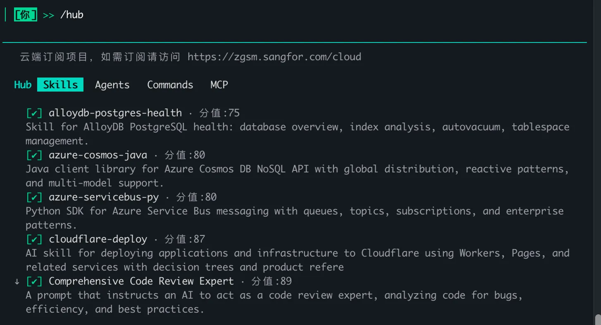

# Knowledge Hub Subscription Guide: From Web to csc Auto-Sync

## Step 1: Find the Capability You Want

1. The Knowledge Hub homepage shows rows of capability cards. You can **search** (top search bar) or **browse by category**.



2. Click any card to open the **detail page**, where you'll see:
   - What the capability does (description)
   - **Health / Assessment Details / Overall Score** (quality indicators)
   - A prominent **Subscribe** button (with a bell icon and subscriber count)



## Step 2: Click "Subscribe"

### General Workflow (Skills / Commands / Sub-Agents)

Click the **Subscribe** button on the detail page or card.

- The button changes to **Unsubscribe**, subscriber count +1, and the bell shakes — that's success.
- Want to unsubscribe? Click **Unsubscribe** again.



That's it. **Subscribing doesn't require downloads or environment setup** — it simply records the capability on your account. The actual download is handled by csc automatically (Step 4).

### Type-Specific Differences

Not all capabilities support one-click subscription.

#### MCP Services — Some Require Parameter Configuration

Some MCPs need you to fill in values first (e.g., local path, API token). The detail page shows a **Parameter Configuration** section with the prompt:

> "This MCP service requires you to fill in some values (such as local path or API token) before use."



Steps:
1. Fill in the required values under **Parameter Configuration** (e.g., "Path", "Parameter 1")
2. Click **Save** (changes to **Saved** on success)
3. The **Subscribe** button is now clickable

## Step 3: Open and Sign In to csc

### 1. Launch csc

Type `csc` in your terminal and press Enter:

- **First launch** includes a brief onboarding: choose a color theme, review the security notice, decide whether to enable terminal optimization — follow the prompts (you can change these later with `/theme` and `/config`).
- Once launched, you'll enter an **interactive conversation interface**: the input box at the bottom is for chatting with AI. Commands start with `/` (e.g., `/login`, `/hub`). Typing `/` auto-suggests available commands.



### 2. Sign In: `/login`

Type in the input box and press Enter:

```
/login
```

- A login dialog opens and **automatically launches your browser** for SSO sign-in. If the browser doesn't open, copy the URL from the prompt into your browser.
- On success, you'll see **Login successful**. Press `Esc` to dismiss. Credentials are saved locally at `~/.costrict/csc-auth.json` — no need to re-login later.





## Step 4: Let csc Auto-Sync (Almost Nothing to Do)

This is the easiest part — **you don't need to manually download anything**.

- **Skills / Commands / Sub-Agents / MCPs:** csc reconciles with the cloud **on every startup**, pulling down and activating your new subscriptions.
- **Plugins:** csc syncs once on startup, then **polls periodically** (default: every 60 seconds) to stay in sync.

In short: **Subscribe on the web → restart csc (or wait) → your content arrives.**

### Manage Subscriptions with `/hub`

In the csc input box, type:

```
/hub
```



- **Top banner:** Links to cloud subscription items — visit [CoStrict Cloud](https://zgsm.sangfor.com/cloud) for the Knowledge Hub.
- **4 tabs:** Skills, Agents, Commands, MCP.

> If you unsubscribed from something on the web but it's still active locally, opening `/hub` prompts: **Cloud favorites updated** — choose **Unload all** or **Keep local config**.

For direct verification, check local files (e.g., `ls ~/.costrict/skills/<name>/` — `SKILL.md` means it's there). Regular users don't need this.

## Step 5: Start Using

Once synced, everything is ready. In the csc input box:

- **Skills / Commands:** Type `/capability-name` to trigger. For example, if you subscribed to `code-review`: `/code-review`
- **Forgot the name?** Type `/help` for all available commands; `/skills` for installed skills.
- **Sub-Agents:** Use `/agents` to view and manage.
- **MCP Services:** Use `/mcp` to manage; `/mcp enable <name>` enables a service so AI can call its tools.
- **Plugins:** Use `/plugin` for the plugin management panel; for instant activation, use `/reload-plugins`.

About **automatic vs. manual** invocation (the option chosen when subscribing):

- **"Allow AI to auto-invoke":** AI will use the capability on its own when needed; you can also manually trigger with `/name`.
- **"Manual only":** AI won't invoke it — only works when you type `/name`.

That completes the "web subscribe → locally available" loop.

## csc Command Quick Reference

| Command | Description |
|---|---|
| `csc` | Launch csc in terminal (enters conversation interface) |
| `/login` | Sign in (must use the same account as web) |
| `/status` | View current account / connection status |
| `/hub` | Open Knowledge Hub panel to manage subscriptions |
| `/help` | List all available commands |
| `/skills` | View installed skills |
| `/name` | Trigger a skill/command (e.g., `/code-review`) |
| `/agents` | Manage sub-agents |
| `/mcp` | Manage MCP services (`/mcp enable <name>`) |
| `/plugin` | Manage plugins (or `csc plugin install <name>@costrict-plugins`) |
| `/reload-plugins` | Activate newly installed plugins without restarting |

## FAQ

**Q1: I subscribed on the web, but it doesn't appear in csc?**

- Check that csc and web are using the same account (most common cause)
- Restart csc (skills/commands sync on startup)
- For plugins, wait briefly (up to ~60 seconds per polling cycle)
- Use `/hub` to check status — "Cloud" means it hasn't been pulled yet; restart to fix

**Q2: The subscribe button is grayed out?**

- Usually an MCP needs "Parameter Configuration" filled in and saved first, or it depends on a plugin. Follow the prompt next to the button.

**Q3: What happens locally after unsubscribing?**

- On the next csc reconciliation, the local copy is handled accordingly. Re-subscribe anytime to use it again.
