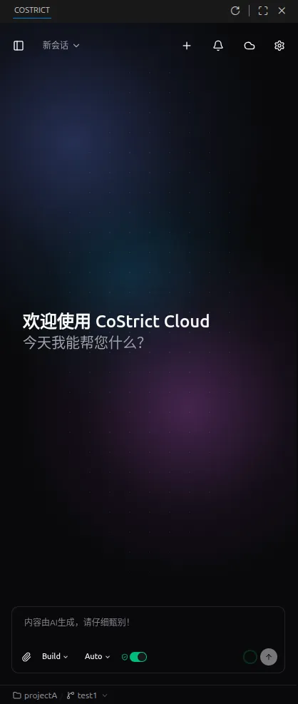
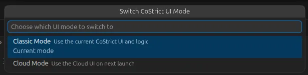
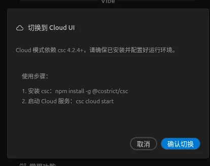
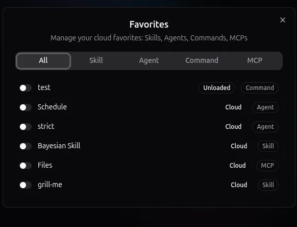
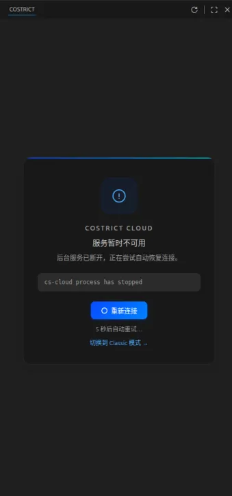

# CoStrict 3.x (Cloud Mode & Classic Mode) User Guide

## Classic Mode and Cloud Mode

**Classic Mode (default):**

**Cloud Mode:**

## Switching Between Modes

### VS Code Shortcut

Use `Ctrl + Shift + P`, then search for "ui mode":

### UI Toggle (JetBrains & VS Code)

**Classic Mode → Cloud Mode:**

The plugin Cloud mode depends on csc and cs-cloud. For first-time use, follow the on-screen prompts before clicking [Confirm Switch].

**Cloud Mode → Classic Mode:**

## Plugin Cloud Mode Basics

### Main Interface

1. Expand conversation history list
2. Current conversation title (dropdown shows recent conversations for quick switching)
3. New conversation
4. Multi-session notifications (Cloud mode supports parallel sessions; other sessions with pending interactions appear here)
5. Remote Cloud Web link & cs-cloud runtime info
6. Switch Agents
7. Switch model
8. Enable auto-approve permissions
9. Context window info

10. Send message / Cancel conversation
11. Workspace switching / Branch switching (plugin Cloud mode supports multiple workspaces)

### Settings Page

1. Username (icon to the right links to personal center)
2. Contact information
3. User ID
4. Quota information
5. Theme color (auto-follows editor dark/light mode if not set)
6. Switch to plugin Classic mode
7. Switch language
8. View version info

### Common Slash Commands

1. `/new`, `/clear` — Start a new conversation
2. `/compact` — Compress conversation context
3. `/hub` — Enable/disable remote Skills, Agents, Commands, MCPs

## Plugin Cloud Mode FAQ

### 1. "401" error when sending messages

You must log in to CoStrict via the csc CLI before using the plugin.

### 2. csc CLI is logged in, but the model list doesn't appear and messages can't be sent

- Check if csc is up to date (run `csc upgrade` to check for available updates)
- Check if cs-cloud is up to date (run `cs-cloud upgrade` to check for available updates)
- Run `csc cloud start` or `csc cloud restart` to ensure the plugin connects to a healthy cs-cloud and csc

### 3. Model list doesn't update after switching model providers in csc CLI

Run `csc cloud restart`.

### 4. cs-cloud service exits abnormally and can't recover after multiple restarts

The plugin will generally auto-reconnect or restart the cs-cloud service. If it fails repeatedly, run `cs-cloud doctor` to check for errors, then send the error details to CoStrict technical support.

### 5. Images cannot be sent correctly

Attachment upload in cs-cloud is still being adapted, and multimodal information can't be correctly passed yet. As a workaround, send the file path to a multimodal-capable model.

### 6. Slow startup with Auto model

Manually select a specific model for conversation — model efficiency and cache hit rates will be better than Auto.

### 7. Network error when sending messages

Check whether the CoStrict baseurl environment variable is correctly set on the plugin's runtime environment (physical machine, remote server, or Docker container).
