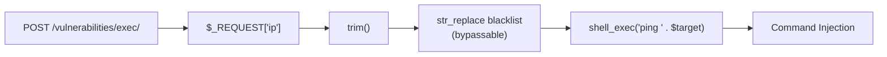

# Security Scanning
<!-- # Quick Start -->

CoStrict Security is a self-developed AI-powered security scanning tool that precisely covers common security vulnerabilities such as injection attacks, unauthorized access, sensitive information leakage, and insecure configurations. It provides complete risk tracing and actionable fix recommendations to help you eliminate security risks before code goes live.

## System Requirements

| Installation Method | Version Requirement | Supported Platforms |
|---|---|---|
| VSCode Plugin | >= 2.4.7 | VSCode |
| JetBrains Plugin | >= 2.4.7 | IDEA / PyCharm / WebStorm, etc. |

## How to Use

Perform interactive security reviews through the IDE during the coding phase, providing real-time assistance to developers in identifying and fixing security issues.

- Supports conversational interaction windows for instant communication and quick issue localization
- Can incorporate prior knowledge (such as business context, threat models, etc.) to improve detection accuracy
- Displays model reasoning process so you know exactly why an issue was reported

### Review Methods

#### Method 1: Review Code File

In the file explorer, **right-click on a file** and select **CoStrict > Security Review** to perform a security review on the entire file.

<!-- TODO: Add screenshot - Review code file -->

#### Method 2: Review Selected Code Snippet

In the editor, **select a code snippet**, then **right-click** and choose **Security Review** to review the selected code.

<!-- TODO: Add screenshot - Review code snippet -->

#### Method 3: Review Code Changes

Click the **CoStrict icon** on the left sidebar, switch to the **CODE REVIEW** page, and select **Security Review** to review code changes in the current workspace (such as Git diffs).

<!-- TODO: Add screenshot - Review code changes -->

### Review Report

After triggering a security review, the AGENT panel displays the review process in real time. During the review, any dangerous operations require manual user confirmation before proceeding. The review duration is proportional to the amount of code being processed, ranging from a few minutes to several tens of minutes. Once the review is complete, a security review report is generated locally in the project. The report includes the following three types:

| Report File | Type | Description |
|---|---|---|
| `task_summary.md` | Summary Report | A human-readable summary for developers, including review overview and issue summary |
| `[target_file]-report-[vulnerability_index].json` | Per-File Vulnerability Report | Detailed vulnerabilities for individual files, suitable for integration into custom review workflows |
| `full_report.jsonl` | Combined Report | A consolidated file of all review results in JSONL format, suitable for engineering workflow integration |

<!-- TODO: Add screenshot - Security review report -->

<details>
<summary>View Report Example</summary>

```
# Security Audit Task Summary

## Audit Overview

| Item | Content |
|------|---------|
| Audit Time | 2025-01-16 |
| Reviewed Directory | e:/Projects/DVWA |
| Files Audited | 1 |
| Vulnerabilities Found | 2 |
| Output Directory | security-review_result/ |

## Audited Files

| File Path | Vulnerabilities | Risk Level |
|-----------|----------------|------------|
| vulnerabilities/exec/source/high.php | 2 | High |

## Vulnerability Statistics

| Vulnerability Type | Count | Severity |
|-------------------|-------|----------|
| Command Injection (COMMAND_INJECTION) | 2 | High |

## Vulnerability Details

### 1. Command Injection - Incomplete Blacklist Filter Allows Pipe Bypass

- **File Location**: `vulnerabilities/exec/source/high.php:24-31`
- **Severity**: High
- **Vulnerability Type**: Command Injection

#### Description

The code uses a blacklist approach to filter Shell special characters in user input, but the blacklist is incomplete. The pipe character filter `'| '` (pipe + space) only filters this exact combination, allowing attackers to bypass it using a pipe without a space `|`.

#### Data Flow



#### Bypass Method

- Payload: `127.0.0.1|whoami` (pipe followed directly by command, no space needed)
- After filtering: `ping 127.0.0.1|whoami` successfully injected

#### Business Impact

- Remote Code Execution (RCE)
- Sensitive Data Leakage
- Privilege Escalation
- Internal Network Penetration

## Fix Recommendations

Replace blacklist filtering with whitelist validation, only allowing legitimate IP address formats:

```php
// Use whitelist validation, only allow legitimate IP address formats
$octet = explode(".", $target);

if ((is_numeric($octet[0])) && (is_numeric($octet[1])) && 
    (is_numeric($octet[2])) && (is_numeric($octet[3])) &&
    (sizeof($octet) == 4) &&
    ($octet[0] >= 0 && $octet[0] <= 255) &&
    ($octet[1] >= 0 && $octet[1] <= 255) &&
    ($octet[2] >= 0 && $octet[2] <= 255) &&
    ($octet[3] >= 0 && $octet[3] <= 255)) {
    // Valid IP address, safe to execute
    $cmd = shell_exec('ping -c 4 ' . $target);
}
```

</details>

