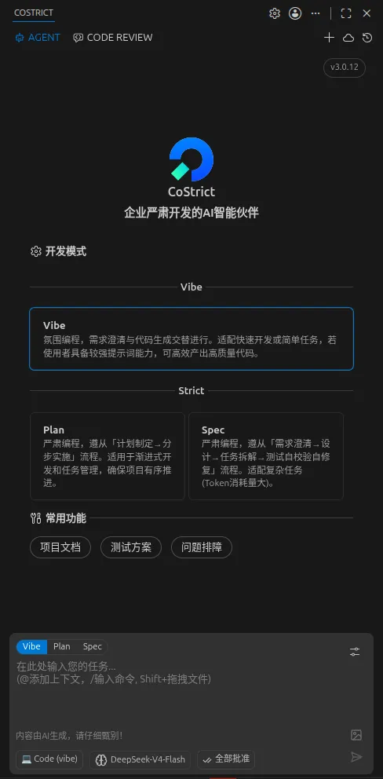
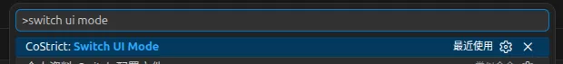
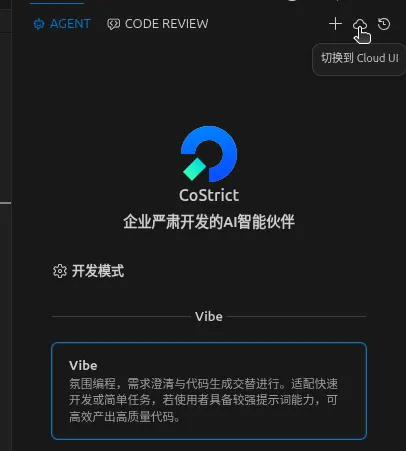
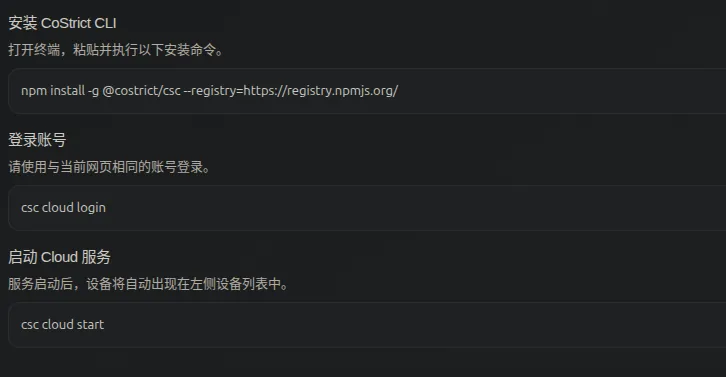
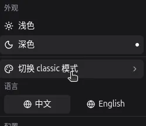
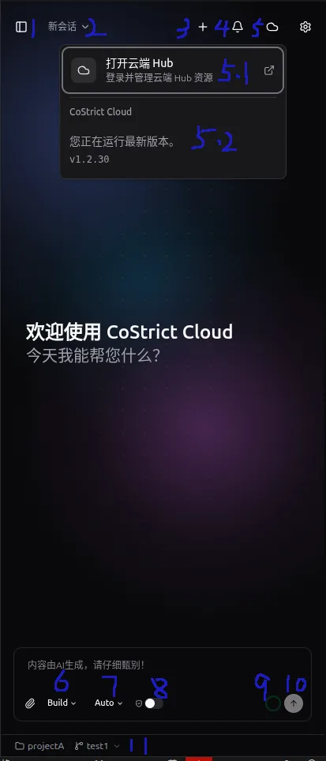
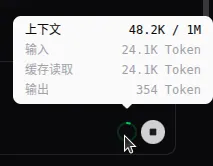
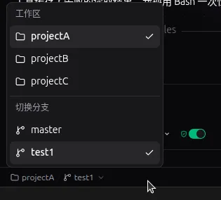
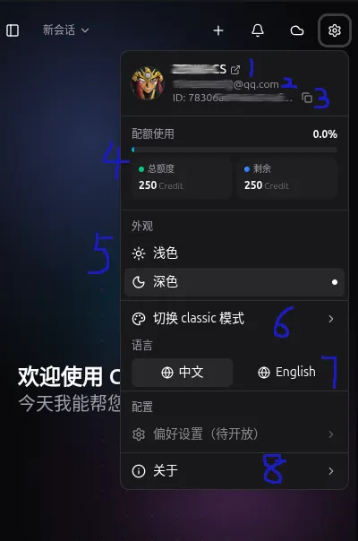
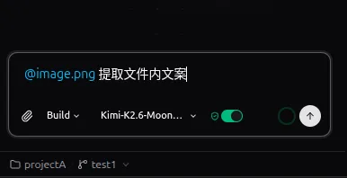

# CoStrict 3.x（Cloud 模式 & Classic 模式）使用指南

## Classic 模式与 Cloud 模式

**Classic 模式（默认）：**

**Cloud 模式：**

## 如何切换双模式

### VS Code 快捷键切换

使用快捷键 `Ctrl + Shift + P`，搜索 "ui mode"：

### UI 开关切换（JetBrains、VS Code 通用）

**Classic 模式 → Cloud 模式：**

插件 Cloud 模式依赖 csc、cs-cloud，首次使用请按提示操作后再点击【确认切换】。

**Cloud 模式 → Classic 模式：**

## 插件 Cloud 模式基本操作指南

### 主界面

1. 展开历史对话列表
2. 当前对话标题（下拉可以看到近期对话，快速切换会话）
3. 新建会话
4. 多会话通知（Cloud 模式下支持多个会话任务并行，其他会话如果有交互请求时会在这里展示）
5. 远程 Cloud Web 跳转链接 & cs-cloud 运行信息展示
6. 切换 Agents
7. 切换模型
8. 开启自动允许授权
9. 上下文窗口信息

10. 发送信息 / 取消对话
11. 工作区切换 / 分支切换（插件 Cloud 模式支持多工作区）

### 设置页

1. 用户名（用户名右侧图标可跳转个人中心）
2. 用户联系方式
3. 用户ID
4. 配额信息
5. 主题颜色（不设置会自动跟随编辑器切换暗色或亮色）
6. 切换到插件经典模式
7. 切换国际化语言
8. 查看版本信息

### 常用斜杠指令

1. `/new`、`/clear` — 新开会话
2. `/compact` — 压缩会话上下文
3. `/hub` — 开启 & 关闭远端 Skills、Agents、Commands、MCPs

## 插件 Cloud 模式常见问题

### 1. 发送消息报错 401

需要使用 csc CLI 登录 CoStrict 才能使用。

### 2. csc CLI 已登录，但插件模型列表未展示，无法发送消息

- 检查 csc 版本是否最新（运行 `csc upgrade` 可以确认是否有可用更新）
- 检查 cs-cloud 版本是否最新（运行 `cs-cloud upgrade` 可以确认是否有可用更新）
- 执行 `csc cloud start` 或 `csc cloud restart` 确保插件连接的是正常的 cs-cloud 和 csc

### 3. csc CLI 切换模型服务商后插件模型列表未更新

执行 `csc cloud restart`。

### 4. cs-cloud 服务异常退出，多次重启后无法正常进入

一般插件会自动重连或重新启动 cs-cloud 服务。如果多次重试失败，可以先运行 `cs-cloud doctor` 命令查看是否有报错，然后将报错信息发送给 CoStrict 技术人员。

### 5. 图片无法正确发送

目前附件上传 cs-cloud 还在兼容中，暂时无法正确传递多模态信息。变通的方式是发送文件的路径给支持多模态的模型。

### 6. Auto 模型对话启动慢

手动指定一个其他模型进行对话，模型效率和缓存命中会比 Auto 模型好。

### 7. 发送消息报网络错误

检查插件运行环境上（物理机器、远程服务器、Docker 容器），CoStrict 的 baseurl 环境变量是否设置正确。
