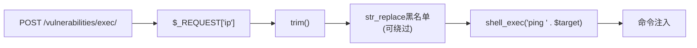

# 安全审查
<!-- # 快速上手 -->

CoStrict Security 是一款自研的 AI 驱动安全扫描工具，精准覆盖注入攻击、越权访问、敏感信息泄露、不安全配置等常见安全漏洞，并提供完整的风险溯源与可执行的修复建议，让你在代码上线前有效消除安全隐患。

## 系统要求

| 安装方式 | 版本要求 | 支持平台 |
|---|---|---|
| VSCode 插件 | ≥ 2.4.7 | VSCode |
| JetBrains 插件 | ≥ 2.4.7 | IDEA / PyCharm / WebStorm 等 |

## 使用方式

在编码阶段通过 IDE 进行交互式安全审查，实时辅助开发人员发现并修复安全问题。

- 支持对话式交互窗口，随时沟通、快速定位问题
- 可结合业务上下文、威胁模型等先验知识，让检测结果更精准
- 展示模型推理过程，让你清楚知道为什么报这个问题

### 审查方式

#### 方式一：审查代码文件

在文件浏览器中**右键点击文件**，选择 **CoStrict > Security Review** 即可对整个文件进行安全审查。


#### 方式二：审查代码片段

在编辑器中**选中代码片段**，**右键点击**选择 **安全审查** 即可对选中的代码进行安全审查。


#### 方式三：审查代码变更

点击左侧 **CoStrict 图标**，切换至 **CODE REVIEW** 页面，选择 **安全扫描**，即可审查当前工作区的代码变更（如 Git 差异）。


### 审查报告

触发安全审查后，AGENT 面板会实时展示审查过程。审查过程中如涉及危险操作，需要用户手动确认后方可继续。审查时长与代码量有关，从几分钟到几十分钟不等。审查完成后，会在项目本地生成安全审查报告。报告包含以下三种类型：

| 报告文件 | 类型 | 说明 |
|---|---|---|
| `task_summary.md` | 总结报告 | 面向开发人员的可读性摘要，包含审查概览与问题汇总 |
| `[目标文件]-report-[漏洞序号].json` | 单文件漏洞报告 | 对应单个文件的漏洞详情，适合接入自定义审查流程 |
| `full_report.jsonl` | 合并报告 | 所有审查结果的汇总文件（JSONL 格式），适合工程化流程对接 |

<details>
<summary>安全审计任务总结 示例</summary>

### 审计概要

| 项目 | 内容 |
|------|------|
| 审计时间 | 2025-01-16 |
| 审查目录 | e:/Projects/DVWA |
| 审计文件数 | 1 |
| 发现漏洞数 | 2 |
| 输出目录 | security-review_result/ |

### 审计文件清单

| 文件路径 | 漏洞数 | 风险等级 |
|----------|--------|----------|
| vulnerabilities/exec/source/high.php | 2 | 高 |

### 漏洞统计

| 漏洞类型 | 数量 | 严重级别 |
|----------|------|----------|
| 命令注入（COMMAND_INJECTION） | 2 | 高 |

---

### <span style={{color: '#E53935'}}>[高]</span> 漏洞详情：命令注入 - 黑名单过滤不完整导致管道符绕过

- **文件位置**: `vulnerabilities/exec/source/high.php:24-31`
- **严重级别**: 高
- **漏洞类型**: 命令注入

**漏洞描述**

代码使用黑名单方式过滤用户输入中的Shell特殊字符，但黑名单不完整。其中对管道符的过滤 `'| '`（管道符+空格）仅过滤该精确组合，攻击者可使用不带空格的管道符 `|` 直接绕过。

**数据流**



**绕过方式**

- Payload: `127.0.0.1|whoami` （管道符后直接跟命令，无需空格）
- 过滤后: `ping 127.0.0.1|whoami` 成功注入

**业务影响**

- 远程代码执行（RCE）
- 敏感数据泄露
- 权限提升
- 内网渗透

**修复建议**

使用白名单验证替代黑名单过滤，仅允许合法IP地址格式：

```php
// 使用白名单验证，仅允许合法IP地址格式
$octet = explode(".", $target);

if ((is_numeric($octet[0])) && (is_numeric($octet[1])) &&
    (is_numeric($octet[2])) && (is_numeric($octet[3])) &&
    (sizeof($octet) == 4) &&
    ($octet[0] >= 0 && $octet[0] <= 255) &&
    ($octet[1] >= 0 && $octet[1] <= 255) &&
    ($octet[2] >= 0 && $octet[2] <= 255) &&
    ($octet[3] >= 0 && $octet[3] <= 255)) {
    // 合法IP地址，安全执行
    $cmd = shell_exec('ping -c 4 ' . $target);
}
```

</details>


